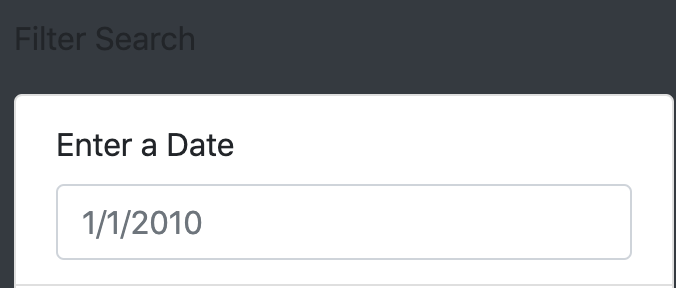

## Project Overview 
We will creating an HTML webpage for Dana, using the UFO dataset she has provided. Using JavaScript, we will write code that appends the table data to the HTML webpage. Thereafter, we will write JavaScript code that allows the user to filter through the dataset and search for UFO sighting’s based upon date, city, state, country, and shape. The final result will be an HTML webpage that includes a data table that filters according to user input. 

## Results 
Upon opening the UFO Sighting’s website, you will be met with a homepage that displays multiple elements. Firstly, you will encounter a tittle (“The Truth is Out There”) which encapsulates the subject of the webpage. Below this you will find a short summary describing the purpose of the website, what it hopes to uncover, and discussion of the data analysis that is featured in the data table below it. There are two components concerning the data table featured at the bottom of the webpage. On the bottom left hand side, you will observe a “Filter Search” subtitle and just below it an input panel where the data can be filtered, and to the right of the panel you will see the data table. The table includes data from a variety of logged UFO sightings which are grouped according to date observed, which city, state, and country they were observed in, what shape they appeared as, any further comments regarding the sighting. 

### Navigate the Filter 
In order to navigate through these filters and select the specific data you desire you will first need to click on the input box located below the input statements (“Enter a …”). 

Following this step you will be required to enter the text of the exact data you would like to select; for example, in the enter a city input box you would type “ Benton” if you would like to see only the data from that exact city. Additionally, the filter panel allows you to apply one or multiple filters at a time by following the second step using multiple input boxes. 

After the filter input has been entered, press the ENTER key on your keyboard and the table will be filtered to return your inputted specifications. 

## Drawbacks 
While Dana’s webpage showcases an appealing and informative website, an outstanding drawback that still remains is a users’ lack of interaction with the webpage. The filters function does offer users with an option to filter the data table, however, there are no other interactive features or opportunities to inquire further into the data. Additionally, the simplicity of the interface could appear less professional and seem like a less reliable source of information. 

## Further Recommendations 
Two additional recommendations I would suggest improving upon these drawbacks is to firstly replace the current navbar and implement a toggle bar which would include tabs such as photos, contact us, etc. that would permit users to inquire further than the data provided in the table. This feature would address the first drawback mentioned previously by providing increased usability for users as well as a greater sese of professionalism and organization for the entirety of the webpage. 

A second recommendation I would propose is to feature an interactive map as opposed to a data table that would be equipped with pinpoints which would be created using Google’s resource gmaps. These pinpoints would represent each UFO sighting in the designated city, country, or state on the map. This feature would permit users to click on a specific pinpoint from which all the sightings in the area would appear and would be able to be filtered out by the date. This feature addresses the second drawback mentioned above as it contributes a more unique interface and encourages interaction with its users. 
